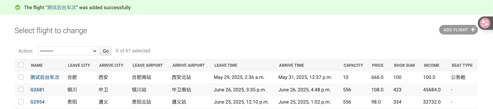

# 鞋城旅行: 高铁查询-订票一站式系统

Before everything:

```sh
conda activate VENV_NAME
# 运行的必要条件
pip3 install Django==3.1.14
pip3 install pymysql
```

确保: 安装成功

```sh
brew services start mysql  
brew services list | grep mysql
```

确保:

```sh
❯ mysql --version                  
mysql  Ver 9.2.0 for macos12 on arm64 (Homebrew)

❯ brew services list | grep mysql
mysql         started         huluobo ~/Library/LaunchAgents/homebrew.mxcl.mysql.plist
```

## Quick Start

创建数据库:

```sh
# 使用root用户登录MySQL
mysql -u root -p

# 删除现有数据库
DROP DATABASE IF EXISTS Flight;
DROP DATABASE IF EXISTS flight1;

# 创建Flight1数据库
CREATE DATABASE Flight1;

# 给admin用户授权访问Flight1数据库
GRANT ALL PRIVILEGES ON Flight1.* TO 'admin'@'localhost';
FLUSH PRIVILEGES;

# 退出MySQL
EXIT;
```

导入现成的“车次”数据:

```sh
# 使用root用户导入数据（或者用admin用户，现在应该有权限了）
mysql -u root -p Flight1 < /Users/huluobo/Desktop/xjtu-homework/db-exp-4/Flight1.sql
# 或者用admin用户
mysql -u admin -p Flight1 < /Users/huluobo/Desktop/xjtu-homework/db-exp-4/Flight1.sql
```

测试导入情况:

```sh
# 使用admin用户测试连接
mysql -u admin -p Flight1

# 在MySQL中验证
SELECT DATABASE();
SELECT COUNT(*) FROM booksystem_flight;
# 如果是60, 则没问题
```

渲染前的测试:

```
python3 manage.py check
python3 manage.py migrate
python3 manage.py runserver
```

## 基础使用


### 1 欢迎界面

拟定一趟行程（南昌→合肥 2025/06/15）


### 2 查询界面

（1）默认的票价信息按照价格升序排列，用户通过点击车票信息上方的字段可以选择按照出发时间或者到达时间升序排列


（2）如果用户需要的车次数据库中不存在，就反馈错误信息


### 3 订票界面

用户注册与登陆


查询车次


点击“订票”


点击“确认”，确定订单


点击“账单”，查看支付状态 （目前还是“待支付”）


前往“个人中心” >> “付款”


付款成功，现在准备“取票”


依据现实情况，进行合理的“取票时间”限制


### 4 退票界面

同理，可以在用户的个人中心进行退票


选择确认，完成退票，用户订票信息刷新

### 5 管理员界面

默认的管理员账户:

- 用户名: admin
- 密码: 123456

PS: 

重置admin密码（如果忘记密码）

```sh
python3 manage.py shell
```

```sh
from django.contrib.auth.models import User
user = User.objects.get(username='admin')
user.set_password('123456')  # 设置新密码
user.save()
print("admin password updated")
exit()
```


代码逻辑中通过 `login_user` 函数中已经有过判定，如果登录用户是管理员，则此时加载财务页面:


财务界面:


说明管理员登录成功

### 6 后台管理界面

链接尾部输入 admin 进入后台管理

```
http://127.0.0.1:8000/booksystem/admin/
```


管理员登录成功，现在进入系统管理后台!

(1) 后台数据查看, 包括 User 和 Django 默认生成的数据:


比如: Users


比如: Orders

(2) 车次信息管理，显示所有车次信息，可以增删改查:


比如: 新增车次:




为确保添加进数据库，我们进数据库CLI检查一下:

```sh
mysql -u admin -p Flight1

# 在MySQL中验证
SELECT DATABASE();
SELECT COUNT(*) FROM booksystem_flight;
SELECT leave_city, arrive_city FROM booksystem_flight;
```


发现现在变成61条了 :))

(3) 旅客信息管理，操作同车次信息管理，注册的用户的信息都会保存在这里:


比如，新增用户:


